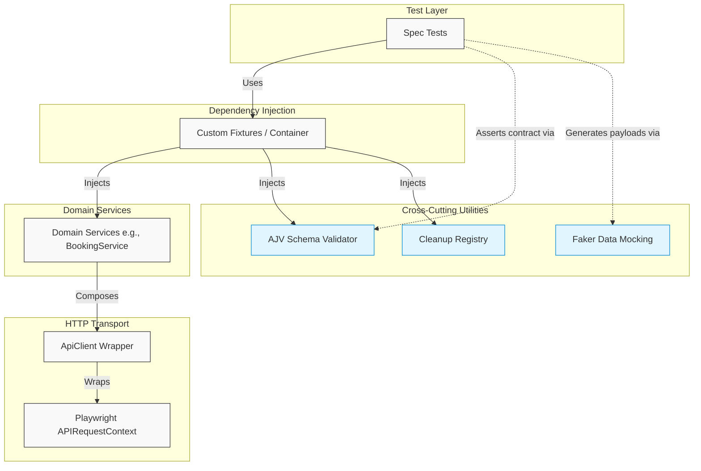

# Enterprise Playwright API Automation Framework

[](https://github.com/JonathanAudris/playwright-api-automation-framework/actions/workflows/api-tests.yml)
[](https://www.typescriptlang.org/)
[](https://playwright.dev/)
[](https://opensource.org/licenses/MIT)

A production-ready API test automation framework built with **Playwright APIRequestContext**, **TypeScript**, and **AJV Schema Validation**, targeting the Restful Booker API. 

This framework demonstrates clean architecture patterns, dependency injection (DI), and strict separation of concerns, serving as an enterprise template for scalable API testing.

---

## 🏗️ Architecture Overview

The framework isolates tests from HTTP details, configuration management, and database-like test state setup. 



For a detailed review of design choices, see [Architecture Documentation](docs/ARCHITECTURE.md).

---

## 🚀 Key Features

* **Dependency Injection:** Tests leverage custom Playwright fixtures (`src/fixtures/index.ts`) rather than manual instantiation of services or HTTP clients.
* **Type-Safe API Client:** Generic `ApiClient` wraps Playwright's network stack to standardize request/response structures, headers, logs, and authentication token injections.
* **High-Performance Contract Verification:** JSON schema validations executed inline via AJV, featuring compiled validator function caching to eliminate compilation overhead.
* **Isolated Environment Configurations:** Strict config validation through `dotenv` and a type-safe configuration object. Environment variables are never accessed directly outside `src/config/env.ts`.
* **Automated Test Cleanup:** A FIFO-based `CleanupRegistry` records created resources during tests and deletes them during teardown, preventing test pollution.

---

## 📂 Project Directory Structure

```
├── .github/workflows/    # CI pipeline (GitHub Actions)
├── docs/                 # Architectural documentation and ADRs
├── src/
│   ├── clients/          # HTTP client wrapper (ApiClient)
│   ├── config/           # Environment validation and configurations
│   ├── constants/        # Route endpoints and static registries
│   ├── fixtures/         # Custom Playwright fixtures & cleanup tools
│   ├── schemas/          # JSON validation schemas (AJV models)
│   ├── services/         # API domain wrappers (Auth, Booking)
│   ├── types/            # TypeScript type declarations
│   ├── utils/            # Test data generators (Faker models)
│   └── validators/       # Schema validation utility
└── tests/                # Playwright functional verification suites
    ├── auth/             # Authentication test scenarios
    ├── booking/          # Booking CRUD test suites
    └── smoke/            # API health check tests
```

---

## 🛠️ Quick Start

### Prerequisites
* **Node.js** >= 20.x
* **npm** >= 10.x

### Installation
1. Clone the repository
2. Install dependencies:
   ```bash
   npm ci
   ```
3. Initialize the environment configuration:
   ```bash
   cp .env.example .env
   ```

### Running Tests
All script commands are configured in `package.json`:

```bash
# Run the entire test suite (Smoke + Regression)
npm run test

# Run only smoke/healthcheck tests
npm run test:smoke

# Run only regression tests
npm run test:regression

# Run specific API domain suites
npm run test:auth
npm run test:booking

# View HTML report from the latest run
npm run report
```

---

## 🖥️ Example Test

Tests remain clean and readable by delegating HTTP, validation, and setup/teardown mechanics to injected fixtures:

```typescript
import { test, expect } from '@fixtures/index';
import { CREATE_BOOKING_RESPONSE_SCHEMA } from '@schemas/booking.schema';
import { DataUtils } from '@utils/data.utils';

test.describe('Create Booking API Tests', () => {
  test('should successfully create a new booking', async ({
    bookingService,
    schemaValidator,
    cleanup,
  }) => {
    // 1. Arrange & Act
    const payload = DataUtils.generateBooking();
    const response = await bookingService.createBooking(payload);

    // 2. Assert
    expect(response.status).toBe(200);
    expect(response.body.bookingid).toBeGreaterThan(0);
    expect(response.body.booking).toEqual(payload);

    // 3. Defer Cleanup
    if (response.body?.bookingid) {
      cleanup.defer(async () => {
        await bookingService.deleteBooking(response.body.bookingid);
      });
    }

    // 4. Validate API Contract
    const validation = schemaValidator.validate(
      CREATE_BOOKING_RESPONSE_SCHEMA,
      response.body,
    );
    expect(validation.isValid, `Schema errors: ${validation.errors?.join('\n')}`).toBe(true);
  });
});
```

---

## 📊 CI/CD & Reporting

This repository runs a GitHub Actions workflow defined in `.github/workflows/api-tests.yml`. 

### Pipeline Workflow:
1. **Setup:** Node.js installation and secure dependency caching (`npm ci`).
2. **Configuration:** Instantiates `.env` dynamically with sensible fallback defaults or repository secrets.
3. **Execution:** Runs the complete Playwright test suite in parallel.
4. **Publishing:** Persists HTML test results to GitHub Artifacts with a 30-day retention window.

---

## 🏛️ Engineering Decisions & ADRs

The architectural choices in this project are documented to explain trade-offs and rationale:
- Refer to [Architecture Design](docs/ARCHITECTURE.md) for details on structural separation and design patterns.
- Refer to [Engineering Decisions Log](docs/ENGINEERING_DECISIONS.md) to understand implementation strategies.
- Review Architecture Decision Records (ADRs) under `docs/adr/`:
  - [ADR 0001: Native APIRequestContext vs Third-Party Clients](docs/adr/0001-framework-http-client.md)
  - [ADR 0002: AJV Schema Validation and Compiled Caching](docs/adr/0002-schema-validation.md)

---

## 🗺️ Roadmap

- [ ] Add API Rate Limit resiliency with built-in retry options in `ApiClient`.
- [ ] Implement visual test coverage reports for endpoints under test.
- [ ] Integrate mock server setups for downstream dependencies.
- [ ] Enable slack/email alerting hooks inside the CI pipeline failures.
