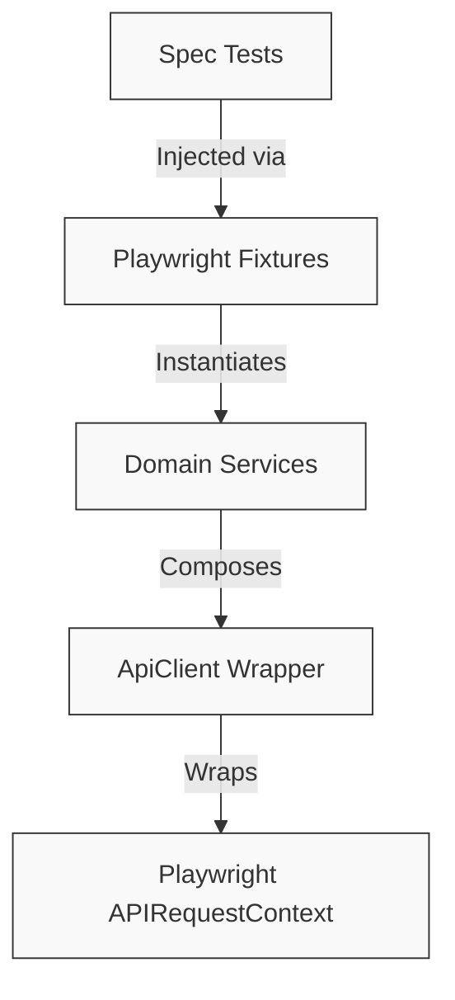
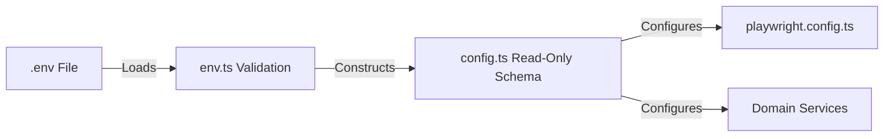

# Framework Architecture Design Document

This document outlines the architectural blueprint, design choices, and data flow of the Playwright API Automation Framework. The system is designed following SOLID principles, clean architecture patterns, and strict Separation of Concerns (SoC).

---

## 🏗️ Structural Overview

The framework is structured as a unidirectional dependency graph, ensuring that high-level layers depend on lower-level abstractions rather than concrete implementations.

---

## 🏛️ Architectural Layers

### 1. Configuration Layer
* **[env.ts](file:///c:/Portofolio/playwright-api-automation-framework/src/config/env.ts)**: Serves as the validation gateway for environment variables. It parses `process.env` immediately at startup and throws structured validation errors if required variables are missing or incorrectly formatted. This prevents runtime failures from silent configuration issues.
* **[config.ts](file:///c:/Portofolio/playwright-api-automation-framework/src/config/config.ts)**: Builds a strongly-typed, read-only configuration schema structure (`AppConfig`) from validated variables, which is safely consumed across tests, Playwright configurations, and services.

### 2. Transport Client Layer
* **[ApiClient.ts](file:///c:/Portofolio/playwright-api-automation-framework/src/clients/ApiClient.ts)**: A generic, type-safe wrapper over Playwright's `APIRequestContext` that standardizes request options (`ApiRequestOptions`) and response structures (`ApiResponse<T>`).
* **Key Design Constraints**:
  - It does not throw exceptions on non-2xx status codes, enabling assertion validation for expected error paths (e.g., `401 Unauthorized`, `404 Not Found`).
  - Standardizes error and metadata reporting (e.g., parsing response bodies and measuring execution response times).

### 3. Business Service Layer
* **Domain Services** (e.g., [BookingService.ts](file:///c:/Portofolio/playwright-api-automation-framework/src/services/BookingService.ts), `AuthService.ts`): Wrap discrete business domains. They map business operations to HTTP actions using the common `ApiClient` transport.
* Services are responsible for managing route endpoints, path parameter interpolation, and authentication headers, isolating spec tests from direct URL and payload formatting.

### 4. Contract Validation Layer
* **[SchemaValidator.ts](file:///c:/Portofolio/playwright-api-automation-framework/src/validators/SchemaValidator.ts)**: Integrates AJV schema validation into the test assertion pipeline. It compiles and caches JSON Schema validator functions dynamically, preventing CPU overhead during repetitive iterations of automated regression runs.

---

## ⚡ Data Flow Pipeline

The framework ensures that initialization configuration flows strictly downward from environment variables to test execution contexts:

---

## 🎨 Core Design Decisions & SOLID Compliance

* **Single Responsibility Principle (SRP):** Classes maintain a single focus. `SchemaValidator` only validates data structures, `ApiClient` executes network transport, and `BookingService` handles business operations.
* **Open/Closed Principle (OCP):** Adding new API endpoints requires writing new services and schema types without modifying the underlying `ApiClient` core.
* **Dependency Inversion Principle (DIP):** Spec tests do not instantiate services or clients. All dependencies are configured and injected dynamically through custom test fixtures in [fixtures/index.ts](file:///c:/Portofolio/playwright-api-automation-framework/src/fixtures/index.ts).
* **Composition over Inheritance:** Domain services delegate low-level request execution to `ApiClient` using configuration composition rather than extending base classes.
* **Zero Direct Environment Access:** Spec tests and services are completely decoupled from host platform environment variables. Direct `process.env` calls are restricted to the configuration layer.
